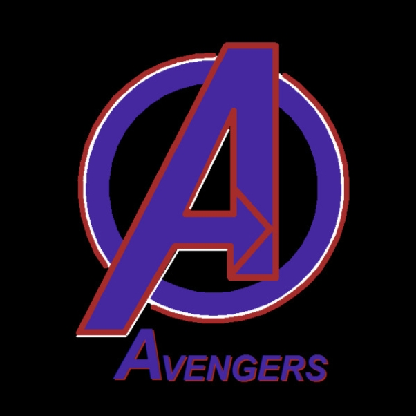
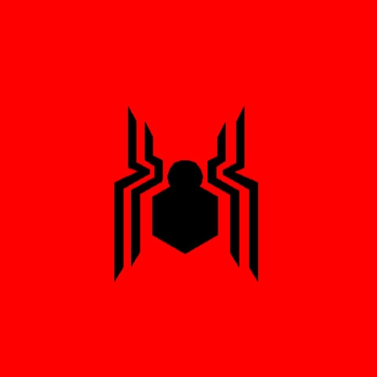
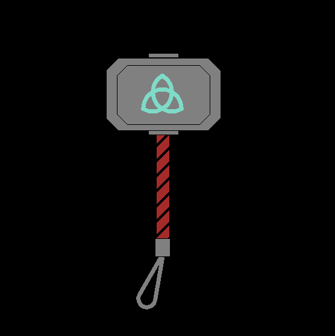
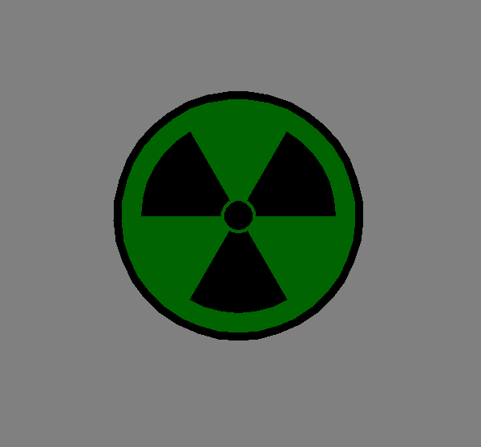
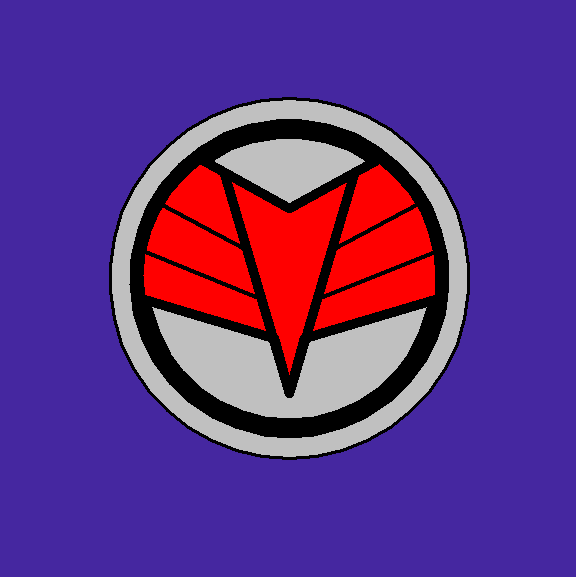

# Avengers Logo using Python Graphics

## Description
   The Avengers are a fictional team of superheroes that appears in American comic books published by Marvel Comics.The Avengers are an all-star ensemble cast of established superhero characters from the Marvel Comics portfolio. Diegetically, these superheroes usually operate independently but occasionally assemble as a team to tackle especially formidable villains.
   
I have created this repository being a big fan of Marvel Avengers and also for those young enthusiasts who loves to code in Python graphics.
## Contents
   This repository consists of Python files having logos of :
* Avengers Assemble
* Iron man
* Captain America
* Hawkeye
* Spiderman
* Hulk
* Thor
* Falcon

## Snapshots
   These are the screenshots of the Python turtle graphics window of the above programs.
 
### Avengers Assemble
  

### Iron man
  
  
### Captain America
  
  
### Black Widow
  
  
### Hawkeye
  
  
### Spiderman
  
  
### Thor
  
  
### Hulk
  
  
### Falcon
  
  
## Contribute
   If you are one of the big fans of Avengers please contribute to the repository by adding more Avengers logos. Thank you.
